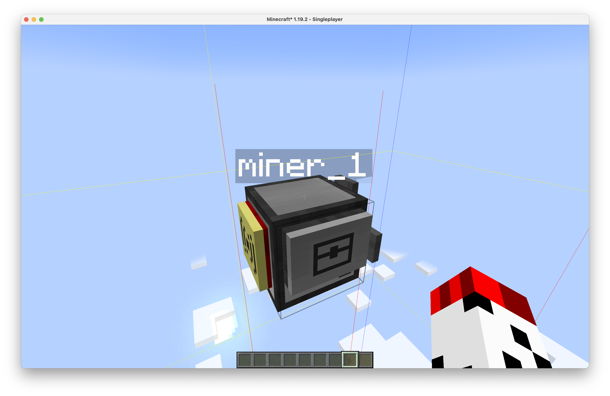
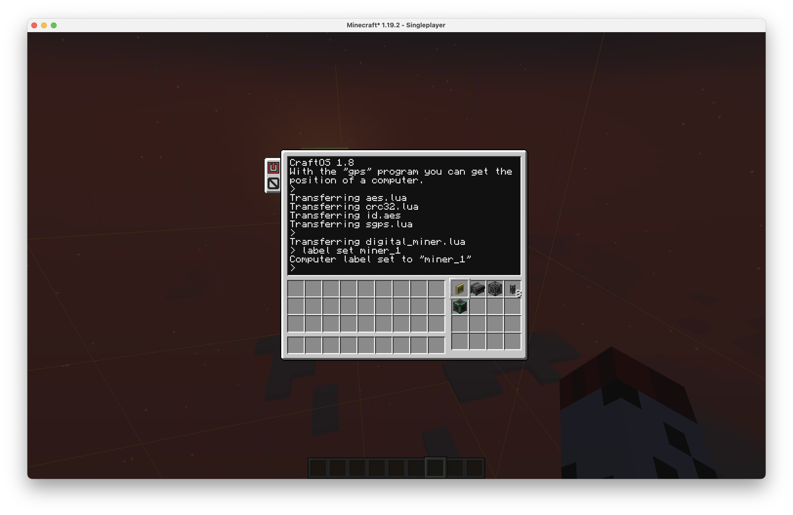

# Digital Miner System

The Digital Miner System allows you to place and move mekanism digital miner automatically.

## Materials

### Base Side (script: [`digital_miner_monitor.lua`](./digital_miner_monitor.lua))

- 1 * Any Computer
- 1 * Any Wireless Modem
- any * Any Monitors

### Miner Side (script: [`digital_miner.lua`](./digital_miner.lua))

- 1 * Any Turtle
- 1 * Ender Modem
- 1 * Diamond Pickaxe
- 1 * Digital Miner _(with eject on and range=32)_
- 1 * Quantum Entangloporter
- 5 * Advanced Universal Cable
- Optional 1 * Chunk Controller
- Optional 1 * Teleporter

## Setup

1. Generate your `id.aes`, use the suggest commands at the top of `aes.lua` 
2. Makesure your did setup [Security GPS](../sgps.lua)

### Base Side

3. Place down a computer with a wireless modem at your base.
4. Copy `digital_miner_monitor.lua` and it's dependencies into the computer. Copy `id.aes`.
5. Edit `startup.lua`, and restart the computer
   ```lua
   shell.run('digital_miner_monitor [<monitor_side>]')
   ```

### Miner Side

6. Since the turtle won't check conflicts, you have to **place it really really high (about y=317)** to avoid stuck in the mountain.
   > Note: You cannot place it at the highest point since the turtle have to place digital miner on top of it. Press F3-G to check the highest border.
   
7. Place the turtle, if you have a chunk controller, **you must equip it on the right side**
8. Copy `digital_miner.lua` and it's dependencies into the turtle. Copy `id.aes`.
9. Use command `label set <label name>` to give your turtle a label.
10. Put all required equipment/machine/cables into the turtle's inventory
   
11. Edit `startup.lua`, and restart the computer
   ```lua
   shell.run('digital_miner placeAndForward launch')
   ```
